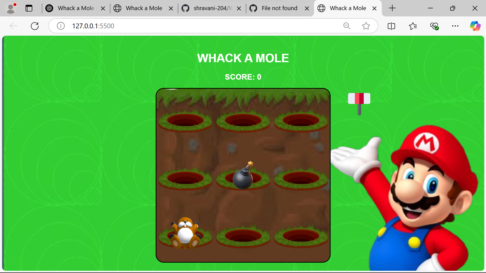
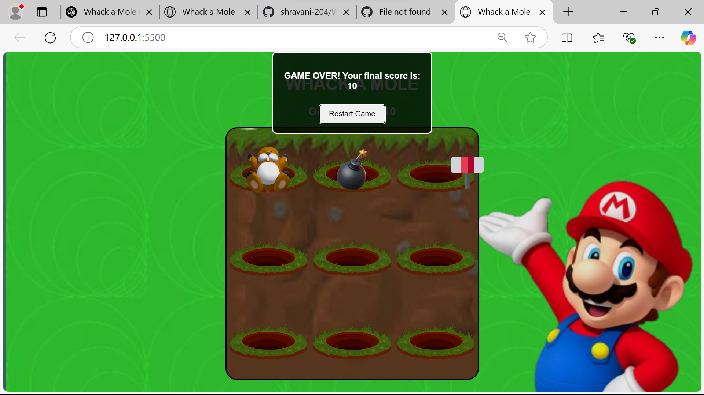

# Whack-a-Mole Game

Welcome to the **Whack-a-Mole** game! This is a simple web-based game made with HTML, CSS, and JavaScript. The goal is to whack moles that pop up randomly on the board while avoiding bombs. Every time you hit a mole, your score increases. But if you hit a bomb, the game ends!

## How to Play

- **Move the Hammer**: Move your mouse around the screen to control the hammer.
- **Hit the Mole**: Click the mole when it pops up to score points.
- **Avoid the Bomb**: If you click on a bomb, the game ends!
- **Restart the Game**: After the game ends, a game-over dialog will appear, showing your score with an option to restart.

## Screenshots

Here are some screenshots showing the game in action:


*Example of moles popping up.*


*Example of the game over screen with the final score.*

## Features

- **Random Mole and Bomb Generation**: Moles and bombs appear at random intervals.
- **Score Tracking**: Your score is updated every time you hit a mole.
- **Game Over Screen**: Once you hit a bomb, the game ends, and your final score is displayed with an option to restart.

## Installation

To play the game on your own system, follow these simple steps:

1. Clone the repository:

   ```bash
   git clone https://github.com/your-username/whack-a-mole.git
   ```

2. Navigate to the project directory:

   ```bash
   cd whack-a-mole
   ```

3. Open the `index.html` file in any modern web browser:

   ```bash
   open index.html
   ```

   Alternatively, just double-click the `index.html` file to open it in your browser.

## Technologies Used

- **HTML**: Used to create the game structure (the board, moles, and bomb placements).
- **CSS**: Provides styling and visuals for the game, such as the grid layout, mole, and bomb images.
- **JavaScript**: Handles the game logic, including setting and removing moles, bombs, and calculating the score.
- **Audio**: Sound effects for hitting the mole and triggering the game over condition.

## Project Structure

- `index.html`: The main HTML file that defines the structure of the game.
- `mole.css`: The CSS file that styles the game grid and UI.
- `mole.js`: The JavaScript file responsible for the game logic.
- `/images/`: Folder containing images like the mole, bomb, and background for the game.
- `/sound/`: Folder containing the sound effects for hitting the mole and the game over sound.

## How the Game Works

1. The game grid is divided into 9 tiles.
2. Every second, a mole will appear randomly in one of the tiles.
3. Every two seconds, a bomb will appear randomly (but not in the same place as the mole).
4. Clicking on the mole will increase the score.
5. Clicking on the bomb will end the game.
6. After the game ends, a dialog box will pop up with the final score and an option to restart the game.

## Acknowledgments

This game was created as a personal project to practice HTML, CSS, and JavaScript. It's inspired by the classic arcade game **Whack-a-Mole**. 

Feel free to explore and improve the game! If you have suggestions or improvements, feel free to fork the repository and submit a pull request.

## Enjoy and have fun playing!
